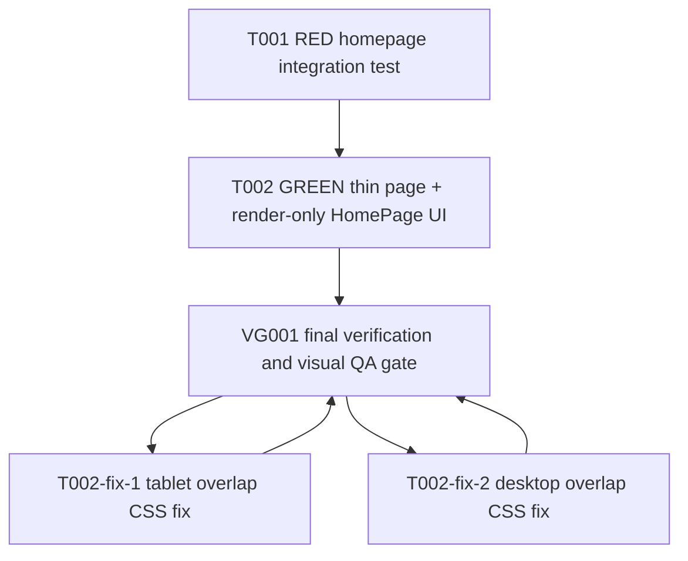

# Homepage Landing Tasks

## Compact Guard

- This file is the human-readable task source of truth for `specs/homepage-landing/`.
- On resume, read `AGENTS.md`, `docs/superpowers/workflow.md`, `specs/homepage-landing/handoff.md`, this file, `specs/homepage-landing/status.json`, `specs/homepage-landing/spec.md`, and `specs/homepage-landing/plan.md` before dispatching work.
- Main agent is control plane only. Repo-changing edits belong to Engineer subagents, including code, executable tests, docs, workflow docs, ADRs, `.codex/**`, scripts, and config.
- Planner has completed the P4 task slicing for this stage. Main validates drift and dispatches task contracts; it does not implement or self-review repo-changing work.
- If this file, `status.json`, and `handoff.md` disagree, reconcile or block before dispatch, commit, push, PR, merge, or local `main` sync.
- A task can become `completed` only after `review_passed` and coordinator state sync.
- Command evidence is one command per entry. Do not combine commands with `&&` or `;`.
- New `status.json` state uses schemaVersion 3 and records `currentHead`, `remoteHead`, `lastVerifiedCommit`, `phaseCommits`, `rulesDeployStatus`, and `incidents`.
- Final summaries must not imply deployed Firestore/storage rules or deployed product behavior unless `rulesDeployStatus.state` is `deployed` with deploy evidence.

## Team And Parallelism

- Profile: P4 full feature.
- Worktree: `/Users/chentzuyu/Desktop/dive-into-run-069-homepage-landing`.
- Branch: `069-homepage-landing`.
- Current implementation parallelism: one Engineer plus one Reviewer lane.
- Reason: the RED test, thin App Router entry, homepage component, and CSS module are one tightly coupled user-facing slice. There are no proven disjoint write sets that would safely support same-wave parallel Engineers.
- Production code edit authorization is active as of 2026-05-21.
- Commit, push, pullRequest, ciWatch, merge, localMainSync, deployFirestoreRules, package changes, global layout changes, Navbar changes, and test-wide rewrites remain unauthorized.
- Same-wave tasks require completely disjoint owned files, one Reviewer per lane, and a final integration gate.
- Shared helpers, config, lockfiles, workflow state, schema, rules, migrations, and release actions must serialize.

## Planner Decisions

- CTA href decision: all event discovery and creation CTAs use `/events`.
- Route evidence: `src/app/events/page.jsx` exists; `src/app/events/[id]/page.jsx` exists; no `src/app/events/create/page.jsx` route was found in `rg --files src/app/events`.
- Open Design topnav is excluded. The homepage component must not render a `nav` element or `role="navigation"`.
- Styling belongs in `src/ui/home/HomePage.module.css`, not `src/app/globals.css`.
- TDD is required: T001 records RED before T002 writes production UI.

## Dependency Graph



## Parallel Waves

| Wave | Tasks | Execution rule |
| --- | --- | --- |
| Wave 1 | `T001` | Single Engineer writes the failing test only. Reviewer checks RED validity. |
| Wave 2 | `T002` | Single Engineer implements production UI only after T001 Reviewer PASS. Reviewer checks implementation diff and GREEN evidence. |
| Wave 2 Fix | `T002-fix-1` | Single Engineer fixes the verifier-rejected tablet overlap in the CSS-owned file. Reviewer checks the narrow fix. |
| Wave 2 Fix 2 | `T002-fix-2` | Single Engineer fixes the verifier-rejected desktop event/map overlap in the CSS-owned file. Reviewer checks the narrow fix. |
| Wave 3 | `VG001` | Verifier/integration gate only. Retry after T002-fix-1 Reviewer PASS. No file writes unless Main explicitly dispatches workflow-state evidence updates. |

## Task T001 - RED Homepage Integration Test

**Role:** Engineer
**Stage:** Implementation
**Profile:** P4
**State:** `completed`
**Attempt:** 1
**Dependencies:** none
**Same-wave lanes:** none

**Scope:**

- Create the failing integration test for the approved homepage landing behavior.
- Do not edit production code.
- Do not make the test pass by weakening assertions.

**Owned files:**

- `tests/integration/app/home-page-entry.test.jsx`

**Read-only context:**

- `AGENTS.md`
- `docs/superpowers/workflow.md`
- `.codex/rules/testing-standards.md`
- `specs/homepage-landing/spec.md`
- `specs/homepage-landing/plan.md`
- `src/app/page.jsx`
- `tests/integration/app/weather-page-entry.test.jsx`

**Forbidden writes:**

- `src/**`
- `tests/e2e/**`
- `package.json`
- `package-lock.json`
- `src/app/layout.jsx`
- `src/app/globals.css`
- Navbar files
- Workflow artifacts, unless Main dispatches a state update separately

**Required protocol:**

- Follow `.codex/rules/testing-standards.md`.
- Integration tests use Testing Library role/text queries through `screen`.
- Do not mock internal app layers.
- Do not use `fireEvent`, fixed sleeps, `toHaveBeenCalledTimes`, or focused/disabled tests.

### Steps

- [ ] **Step 1: Create the test file**

Write `tests/integration/app/home-page-entry.test.jsx` with assertions equivalent to this contract:

```jsx
import { render, screen, within } from '@testing-library/react';
import { describe, expect, it } from 'vitest';
import Home from '@/app/page';

describe('homepage app entry', () => {
  it('renders the landing page sections without duplicating navigation', () => {
    render(<Home />);

    const mainHeading = screen.getByRole('heading', { level: 1, name: /Dive Into Run/i });
    expect(mainHeading).toHaveTextContent('今天，一起出門跑。');
    expect(
      screen.getByText(/找到配速剛好、時間地點合適的跑步揪團/),
    ).toBeInTheDocument();
    expect(screen.queryByRole('navigation')).not.toBeInTheDocument();

    const viewActivityLinks = screen.getAllByRole('link', { name: /查看揪團活動|看全部活動/ });
    expect(viewActivityLinks.length).toBeGreaterThanOrEqual(2);
    for (const link of viewActivityLinks) {
      expect(link).toHaveAttribute('href', '/events');
    }

    const createActivityLinks = screen.getAllByRole('link', { name: '新增跑步揪團' });
    expect(createActivityLinks.length).toBeGreaterThanOrEqual(2);
    for (const link of createActivityLinks) {
      expect(link).toHaveAttribute('href', '/events');
    }

    expect(
      screen.getByRole('region', { name: '首頁主視覺' }),
    ).toBeInTheDocument();
    expect(
      screen.getByRole('region', { name: '可以加入的揪團活動' }),
    ).toBeInTheDocument();
    expect(
      screen.getByRole('region', { name: '加入活動前，先把必要資訊看清楚。' }),
    ).toBeInTheDocument();
    expect(
      screen.getByRole('region', { name: '跑者公開檔案情境' }),
    ).toBeInTheDocument();
    expect(
      screen.getByRole('region', { name: '建立清楚的活動頁' }),
    ).toBeInTheDocument();
  });

  it('shows static run, trust, profile, scene, and footer context', () => {
    render(<Home />);

    const runGroups = screen.getByRole('region', { name: '可以加入的揪團活動' });
    expect(within(runGroups).getByRole('heading', { name: '大安森林公園 8K' })).toBeInTheDocument();
    expect(within(runGroups).getByRole('heading', { name: '河濱輕鬆跑 5K' })).toBeInTheDocument();
    expect(within(runGroups).getByRole('heading', { name: '松山機場外圈 10K' })).toBeInTheDocument();
    expect(within(runGroups).getByText('6:30/km')).toBeInTheDocument();
    expect(within(runGroups).getByText('7:00/km')).toBeInTheDocument();
    expect(within(runGroups).getByText('5:50/km')).toBeInTheDocument();

    expect(screen.getByText('22°C 微風，適合晨跑')).toBeInTheDocument();
    expect(screen.getByText(/大安森林公園 · 06:18/)).toBeInTheDocument();
    expect(screen.getByText(/集合 pin · 捷運大安森林公園 2 號出口/)).toBeInTheDocument();

    expect(screen.getByRole('heading', { name: '跑者公開檔案' })).toBeInTheDocument();
    expect(screen.getByRole('heading', { name: 'Strava 跑步紀錄' })).toBeInTheDocument();
    expect(screen.getByRole('heading', { name: '文章與活動留言' })).toBeInTheDocument();

    const profile = screen.getByRole('region', { name: '跑者公開檔案情境' });
    expect(within(profile).getByText(/陳以文 · 台北晨跑/)).toBeInTheDocument();
    expect(within(profile).getByText('18')).toBeInTheDocument();
    expect(within(profile).getByText('42')).toBeInTheDocument();
    expect(within(profile).getByText('328.4 km')).toBeInTheDocument();

    expect(screen.getByRole('contentinfo')).toHaveTextContent('Dive Into Run');
    expect(screen.getByRole('contentinfo')).toHaveTextContent('Taipei running community');
  });
});
```

- [ ] **Step 2: Run focused RED verification**

Run:

```bash
npm run test:browser -- --run tests/integration/app/home-page-entry.test.jsx
```

Expected signal:

- Exit code is non-zero.
- Failure is caused by missing homepage landing UI, such as missing CTA links or named regions.
- Failure is not caused by syntax errors, import errors, provider setup, invalid Testing Library usage, or environment setup.

- [ ] **Step 3: Report RED evidence**

Engineer output must include:

- Changed file list.
- Exact command.
- Exit code.
- The first meaningful assertion failure.
- Confirmation that no production source files were edited.
- Any uncertainty or blocked item.

**Acceptance criteria:**

- `tests/integration/app/home-page-entry.test.jsx` exists.
- Test imports `Home` from `@/app/page`.
- Test asserts CTA hrefs are `/events`.
- Test asserts no homepage `navigation` landmark.
- Test asserts hero, available run groups, trust/system, runner profile, CTA panel, and footer content.
- Focused command fails for the expected missing homepage UI reason.

**Reviewer PASS criteria:**

- Diff only touches `tests/integration/app/home-page-entry.test.jsx`.
- Assertions are role/text-first and aligned with the approved spec and `plan.md`.
- The RED failure proves a real product gap and would pass only after the planned homepage UI exists.
- No internal-layer mocks, fixed sleeps, `fireEvent`, focused/disabled tests, or brittle call-count assertions.
- CTA href assertions are exactly `/events`.

**Reviewer REJECT criteria:**

- Test passes before production implementation.
- Test fails because of syntax/import/provider/environment errors.
- Test omits one or more required sections.
- Test accepts `#runs`, `/events/create`, or any unverified route as an event CTA.
- Test renders or expects a second navigation landmark.
- Test writes or requires production source changes.

**Evidence:**

- Engineer report:
  - Status: DONE.
  - Changed files: `tests/integration/app/home-page-entry.test.jsx`.
  - Command: `npm run test:browser -- --run tests/integration/app/home-page-entry.test.jsx`.
  - Exit: `1`.
  - RED failure: `expect(mainHeading).toHaveTextContent('今天，一起出門跑。')`; current page rendered only `Dive Into Run`, and required homepage regions are missing.
  - Production files: no `src/**` diff.
  - Environment note: first attempt was blocked by missing `node_modules`; Main ran `npm ci`, then Engineer reran RED successfully.
- Reviewer report:
  - Decision: review_passed.
  - Command: `npm run test:browser -- --run tests/integration/app/home-page-entry.test.jsx`.
  - Exit: `1`.
  - Evidence: RED failed for missing hero copy/required homepage region, not syntax/import/provider/environment; CTA href assertions are exactly `/events`; no tracked `src/**` diff.

## Task T002 - GREEN Thin Page And Render-Only HomePage UI

**Role:** Engineer
**Stage:** Implementation
**Profile:** P4
**State:** `completed`
**Attempt:** 1
**Dependencies:** `T001` reviewed RED evidence
**Same-wave lanes:** none

**Scope:**

- Implement the static homepage landing UI to satisfy T001.
- Keep `src/app/page.jsx` thin.
- Keep styling component-scoped.
- Preserve the global Navbar by not modifying layout/Navbar files and not rendering homepage navigation.

**Owned files:**

- `src/app/page.jsx`
- `src/ui/home/HomePage.jsx`
- `src/ui/home/HomePage.module.css`

**Read-only context:**

- `AGENTS.md`
- `docs/superpowers/workflow.md`
- `.codex/rules/testing-standards.md`
- `.codex/rules/sensors.md`
- `specs/homepage-landing/spec.md`
- `specs/homepage-landing/plan.md`
- `specs/homepage-landing/tasks.md`
- `src/app/page.jsx`
- `src/app/layout.jsx`
- `src/app/globals.css`
- `src/app/events/page.jsx`
- `tests/integration/app/home-page-entry.test.jsx`
- `tests/e2e/quality-gates/hydration-smoke.spec.js`
- `tests/e2e/quality-gates/axe-smoke.spec.js`
- Open Design MCP artifact `dive-into-run-website-ui / index.html`

**Forbidden writes:**

- `tests/**`
- `src/app/layout.jsx`
- `src/app/globals.css`
- Navbar files
- `package.json`
- `package-lock.json`
- Any Firebase, service, repo, runtime hook, API route, auth, posts, runs, weather, or event-detail file
- Workflow artifacts, unless Main dispatches a state update separately

**Required protocol:**

- Do not add `'use client'` unless a specific browser-only API is introduced; this plan requires none.
- Do not add dependencies.
- Do not import Open Design fonts.
- Do not copy the Open Design `topnav`.
- Use static presentation data only.

### Steps

- [ ] **Step 1: Confirm T001 RED evidence is available**

Do not edit production code until T001 has Reviewer PASS and a focused RED command failure caused by missing homepage UI.

- [ ] **Step 2: Make the App Router entry thin**

Update `src/app/page.jsx` to follow this shape:

```jsx
import HomePage from '@/ui/home/HomePage';

/**
 * 首頁元件。
 * @returns {import('react').JSX.Element} 首頁。
 */
export default function Home() {
  return <HomePage />;
}
```

- [ ] **Step 3: Create render-only homepage component**

Create `src/ui/home/HomePage.jsx` with this structure:

```jsx
import Link from 'next/link';
import styles from './HomePage.module.css';

const EVENTS_HREF = '/events';

const RUN_GROUPS = [
  {
    title: '大安森林公園 8K',
    time: '週六 06:30',
    tag: '晨跑',
    pace: '6:30/km',
    meetingPoint: '2 號出口',
    distance: '8K',
    participants: '7 人',
    trust: '可查看公開檔案',
  },
  {
    title: '河濱輕鬆跑 5K',
    time: '今天 19:20',
    tag: '新手友善',
    pace: '7:00/km',
    meetingPoint: '古亭河濱',
    distance: '5K',
    participants: '5 人',
    trust: '主揪完成 12 場',
  },
  {
    title: '松山機場外圈 10K',
    time: '週日 07:00',
    tag: '穩定配速',
    pace: '5:50/km',
    meetingPoint: '民權公園',
    distance: '10K',
    participants: '9 人',
    trust: '已設定活動路線',
  },
];

const TRUST_ITEMS = [
  {
    title: '跑者公開檔案',
    body: '顯示頭像、名稱、簡介、加入日期、開團數與參團數；連結 Strava 時可呈現累計距離。',
  },
  {
    title: 'Strava 跑步紀錄',
    body: '連結 Strava 後，在跑步頁同步個人活動、距離、配速、時間與路線圖。',
  },
  {
    title: '文章與活動留言',
    body: '文章河道可分享跑步故事；活動詳情支援留言、參加者列表、收藏與分享。',
  },
];

/**
 * Render-only homepage landing screen.
 * @returns {import('react').JSX.Element} Homepage screen.
 */
export default function HomePage() {
  return (
    <>
      <main className={styles.home} aria-labelledby="homepage-title">
        <section className={styles.hero} aria-labelledby="homepage-title">
          {/* Hero copy, CTAs, proof, and scene. */}
        </section>
        <section className={styles.runGroups} aria-labelledby="run-groups-title">
          {/* Three RUN_GROUPS cards and /events link. */}
        </section>
        <section className={styles.trustSystem} aria-labelledby="trust-title">
          {/* TRUST_ITEMS. */}
        </section>
        <section className={styles.profileContext} aria-labelledby="profile-title">
          {/* Runner profile and product context. */}
        </section>
        <section className={styles.ctaSection} aria-labelledby="cta-title">
          {/* Final /events CTAs. */}
        </section>
      </main>
      <footer className={styles.footer}>
        {/* Page-specific footer content. */}
      </footer>
    </>
  );
}
```

The comment markers above are structural guides only for the Engineer. The final component must contain real JSX content and should not leave empty comment-only sections.

- [ ] **Step 4: Implement semantic content and links**

Required implementation details:

- Hero section has `aria-labelledby="homepage-title"` and H1 id `homepage-title`.
- Run groups section has heading id `run-groups-title` with exact text `可以加入的揪團活動`.
- Trust section heading id `trust-title` has exact accessible name `加入活動前，先把必要資訊看清楚。`.
- Profile section heading id `profile-title` has exact accessible name `跑者公開檔案情境`.
- CTA section heading id `cta-title` has exact accessible name `建立清楚的活動頁`.
- All `Link` components for event viewing or creation use `href={EVENTS_HREF}`.
- Do not render `<nav>`, `<header>`, or `role="navigation"` in `HomePage`.
- Decorative scene containers and graphics use `aria-hidden="true"`.
- Scene facts also appear as normal text: `22°C 微風，適合晨跑`, `大安森林公園 · 06:18 集合中`, and `集合 pin · 捷運大安森林公園 2 號出口`.

- [ ] **Step 5: Create CSS module**

Create `src/ui/home/HomePage.module.css` with component-scoped rules:

```css
.home {
  --home-bg: oklch(98% 0.012 88);
  --home-surface: oklch(100% 0 0);
  --home-fg: oklch(21% 0.035 164);
  --home-muted: oklch(45% 0.026 168);
  --home-border: oklch(88% 0.018 118);
  --home-accent: oklch(34% 0.07 164);
  --home-route: oklch(57% 0.15 238);
  --home-sun: oklch(72% 0.14 72);
  --home-grass: oklch(62% 0.11 148);
  background: linear-gradient(
      180deg,
      color-mix(in oklch, var(--home-sun) 10%, var(--home-bg)) 0%,
      var(--home-bg) 42%
    ),
    var(--home-bg);
  color: var(--home-fg);
  overflow-x: clip;
}

.sectionInner {
  width: min(100%, 1180px);
  margin-inline: auto;
  padding-inline: clamp(18px, 4vw, 32px);
}

.linkButton:focus-visible {
  outline: 3px solid color-mix(in oklch, var(--home-route) 70%, white);
  outline-offset: 3px;
}

@media (prefers-reduced-motion: reduce) {
  .home *,
  .home *::before,
  .home *::after {
    animation-duration: 0.01ms;
    animation-iteration-count: 1;
    scroll-behavior: auto;
    transition-duration: 0.01ms;
  }
}
```

Required CSS behavior:

- Desktop hero uses grid with two columns at wide widths.
- Mobile hero uses one column.
- Floating cards are absolute only when there is enough width; below the chosen breakpoint they become static stacked cards.
- CTA buttons wrap without clipping text.
- Join cards stack on phone and can show three columns on desktop.
- Card radius stays `8px` or less unless a scene container needs `10px` to match the Open Design artifact.
- Letter spacing is `0`.

- [ ] **Step 6: Run focused GREEN verification**

Run:

```bash
npm run test:browser -- --run tests/integration/app/home-page-entry.test.jsx
```

Expected signal:

- Exit code is `0`.
- Homepage integration test passes without editing the test from T001.

- [ ] **Step 7: Run changed-file quality checks**

Run:

```bash
npm run lint:changed
```

Expected signal:

- Exit code is `0`.

Run:

```bash
npm run type-check:changed
```

Expected signal:

- Exit code is `0`.

- [ ] **Step 8: Report GREEN evidence**

Engineer output must include:

- Changed file list.
- Confirmation that T001 test file was not edited in T002.
- Exact commands and exit codes.
- Notes on responsive implementation choices.
- Confirmation that `src/app/layout.jsx`, `src/app/globals.css`, Navbar files, `package.json`, and `package-lock.json` were not edited.
- Any residual risk or unverified item.

**Acceptance criteria:**

- T001 focused integration test passes.
- `/` app entry is thin and delegates to `HomePage`.
- Homepage has required Open Design sections and static content.
- All event CTAs use `/events`.
- Homepage renders no `navigation` landmark.
- Global layout/Navbar files are unchanged.
- No new dependency, live data access, runtime hook, Firebase, service, repo, or API route is introduced.
- CSS module handles 375px, 768px, and 1280px layout requirements.
- Reduced-motion and focus-visible styles exist.

**Reviewer PASS criteria:**

- Diff only touches `src/app/page.jsx`, `src/ui/home/HomePage.jsx`, and `src/ui/home/HomePage.module.css`.
- T001 test file is unchanged during T002.
- App entry stays thin.
- Component is render-only and server-compatible.
- CTA hrefs are exactly `/events`.
- No duplicate nav/topnav/header chrome exists in the homepage component.
- Accessibility semantics match `plan.md`.
- Focused integration, lint changed, and type-check changed commands pass.
- Visual risks are either already addressed in code or explicitly handed to VG001 for browser evidence.

**Reviewer REJECT criteria:**

- Any forbidden file is modified.
- Component imports runtime/service/repo/Firebase/weather/Strava data or uses live data fetching.
- Component renders a second nav/header/topnav or competes with the global Navbar.
- CTA hrefs use `/events/create`, `#runs`, or any route other than `/events`.
- T001 test was changed to make implementation pass.
- CSS creates likely horizontal scrolling, text clipping, invisible focus, or insufficient reduced-motion handling.
- Commands fail or are not run.

**Evidence:**

- Engineer report:
  - Status: DONE.
  - Changed files: `src/app/page.jsx`, `src/ui/home/HomePage.jsx`, `src/ui/home/HomePage.module.css`.
  - Commands:
    - `npm run test:browser -- --run tests/integration/app/home-page-entry.test.jsx`: exit `1` before implementation, confirming RED remained valid.
    - `npm run test:browser -- --run tests/integration/app/home-page-entry.test.jsx`: exit `0` after implementation.
    - `npm run lint:changed`: exit `1`, then exit `0` after helper-order fix.
    - `npm run type-check:changed`: exit `0`.
  - Summary: thin `/` entry delegates to `HomePage`; static render-only homepage UI added; scoped CSS includes responsive layout, focus-visible, and reduced-motion handling; no `use client`, nav/header/navigation landmark, live data, or new dependencies.
  - Test file: not edited during T002.
- Reviewer report:
  - Decision: review_passed.
  - Commands:
    - `npm run test:browser -- --run tests/integration/app/home-page-entry.test.jsx`: exit `0`.
    - `npm run lint:changed`: exit `0`, with existing React-version ESLint warning only.
    - `npm run type-check:changed`: exit `0`.
  - Evidence: app entry stays thin; component imports only `next/link` and CSS; no `use client`, runtime/service/repo/Firebase/live data, homepage nav/header/navigation landmark, `/events/create`, or `#runs`; all CTAs use `/events`; T001 test still matches the contract.

## Task T002-fix-1 - Fix Tablet Hero Card Overlap

**Role:** Engineer
**Stage:** Debug fix
**Profile:** P4
**State:** `completed`
**Attempt:** 1
**Dependencies:** `VG001` review_rejected browser evidence and Debugger diagnosis
**Same-wave lanes:** none

**Scope:**

- Fix the 768x1024 weather chip and event card overlap in the hero scene.
- Keep the fix scoped to responsive CSS for the 641-820px band unless evidence requires otherwise.

**Owned files:**

- `src/ui/home/HomePage.module.css`

**Read-only context:**

- `src/ui/home/HomePage.module.css`
- `src/ui/home/HomePage.jsx`
- `specs/homepage-landing/plan.md`
- `VG001` browser evidence
- Debugger diagnosis

**Forbidden writes:**

- `src/ui/home/HomePage.jsx`
- `src/app/page.jsx`
- `tests/**`
- `package.json`
- `package-lock.json`
- `src/app/layout.jsx`
- `src/app/globals.css`
- Navbar files

**Required protocol:**

- Use the Debugger root cause: at 768px, `max-width: 1080px` stretches `.eventCard` while `.weatherChip` keeps the desktop `top` and `left`.
- Add the smallest CSS media-query fix so the weather chip sits above the stretched event card at 641-820px.
- Do not edit JSX or tests.

**Acceptance criteria:**

- At 768x1024, the weather chip and event card no longer overlap.
- 375x812 and 1280x800 visual behavior remains in scope for verifier recheck.
- Focused integration, lint changed, and type-check changed remain green.

**Verification commands:**

| Command | Expected signal | Latest evidence |
| --- | --- | --- |
| `npm run test:browser -- --run tests/integration/app/home-page-entry.test.jsx` | Exit `0`. | Exit `0`; 1 file / 2 tests passed. |
| `npm run lint:changed` | Exit `0`. | Exit `0`; existing React-version warning only. |
| `npm run type-check:changed` | Exit `0`. | Exit `0`; no type errors in changed files. |

**Reviewer PASS criteria:**

- Diff touches only `src/ui/home/HomePage.module.css`.
- Fix addresses the diagnosed 641-820px overlap without broad unrelated restyling.
- Focused integration, lint changed, and type-check changed pass.

**Reviewer REJECT criteria:**

- Diff touches JSX, tests, package files, global styles, Navbar, or workflow files without Main authorization.
- Fix is a broad unrelated redesign.
- Verification commands fail or are not run.

**Evidence:**

- Engineer report:
  - Status: DONE.
  - Changed files: `src/ui/home/HomePage.module.css`.
  - Change: added a 641-820px media query that moves `.weatherChip` to `top: 28px; left: 28px;` and `.eventCard` to `top: 96px;`.
  - Commands:
    - `npm run test:browser -- --run tests/integration/app/home-page-entry.test.jsx`: exit `0`; 1 file / 2 tests passed.
    - `npm run lint:changed`: exit `0`; existing React-version warning only.
    - `npm run type-check:changed`: exit `0`; no type errors in changed files.
  - Residual risk: visual overlap must still be rechecked by `VG001` Browser evidence.
- Reviewer report:
  - Decision: review_passed.
  - Commands:
    - `npm run test:browser -- --run tests/integration/app/home-page-entry.test.jsx`: exit `0`; 1 file / 2 tests passed.
    - `npm run lint:changed`: exit `0`; existing React-version warning only.
    - `npm run type-check:changed`: exit `0`; no type errors in changed files.
  - Evidence: CSS fix is narrowly targeted to the diagnosed 641-820px tablet band and only changes positional separation for `.weatherChip` and `.eventCard`; Browser visual QA still must be rerun by `VG001`.

## Task T002-fix-2 - Fix Desktop Hero Event And Map Card Overlap

**Role:** Engineer
**Stage:** Debug fix
**Profile:** P4
**State:** `completed`
**Attempt:** 1
**Dependencies:** `VG001` attempt 2 review_rejected browser evidence and Debugger diagnosis
**Same-wave lanes:** none

**Scope:**

- Fix the 1280x800 event card and map card overlap in the hero scene.
- Keep the fix scoped to responsive CSS for desktop hero scene spacing or height.
- Preserve the already passing 375x812 and 768x1024 behavior.

**Owned files:**

- `src/ui/home/HomePage.module.css`

**Read-only context:**

- `src/ui/home/HomePage.module.css`
- `src/ui/home/HomePage.jsx`
- `specs/homepage-landing/tasks.md`
- `specs/homepage-landing/handoff.md`
- `VG001` retry browser evidence
- Debugger diagnosis for 1280x800 event/map overlap

**Forbidden writes:**

- `src/ui/home/HomePage.jsx`
- `src/app/page.jsx`
- `tests/**`
- `package.json`
- `package-lock.json`
- `src/app/layout.jsx`
- `src/app/globals.css`
- Navbar files
- Workflow artifacts, unless Main dispatches a state update separately

**Required protocol:**

- Use the Debugger root cause: at 1280x800, desktop base CSS keeps `.sceneWrap` at `min-height: 540px` while `.eventCard` uses top alignment and `.mapCard` uses bottom alignment in the same relative container.
- Add the smallest CSS fix, preferably a `1081px-1320px` desktop media query that gives the hero scene enough vertical space or separates the event/map slots.
- Do not edit JSX or tests.

**Acceptance criteria:**

- At 1280x800, event card and map card no longer overlap.
- 375x812 and 768x1024 remain in scope for verifier recheck.
- Focused integration, lint changed, and type-check changed remain green.

**Verification commands:**

| Command | Expected signal |
| --- | --- |
| `npm run test:browser -- --run tests/integration/app/home-page-entry.test.jsx` | Exit `0`. |
| `npm run lint:changed` | Exit `0`. |
| `npm run type-check:changed` | Exit `0`. |

**Reviewer PASS criteria:**

- Diff touches only `src/ui/home/HomePage.module.css`.
- Fix addresses the diagnosed 1280x800 desktop event/map overlap without broad unrelated restyling.
- Focused integration, lint changed, and type-check changed pass.

**Reviewer REJECT criteria:**

- Diff touches JSX, tests, package files, global styles, Navbar, or workflow files without Main authorization.
- Fix is a broad unrelated redesign.
- Verification commands fail or are not run.

**Evidence:**

- Engineer report:
  - Status: DONE.
  - Changed files: `src/ui/home/HomePage.module.css`.
  - Change: added a `1081px-1320px` desktop media query that sets `.sceneWrap` to `min-height: 670px` and `.morningScene` to `min-height: 620px`.
  - Rationale: gives the absolute-positioned `.eventCard` top slot and `.mapCard` bottom slot enough vertical space at 1280x800 without touching `<=1080px` tablet/mobile rules.
  - Commands:
    - `npm run test:browser -- --run tests/integration/app/home-page-entry.test.jsx`: exit `0`; 1 file / 2 tests passed.
    - `npm run lint:changed`: exit `0`; existing React-version warning only.
    - `npm run type-check:changed`: exit `0`; no type errors in changed files.
  - Residual risk: Browser QA still must rerun at 375x812, 768x1024, and 1280x800.
- Reviewer report:
  - Decision: review_passed.
  - Commands:
    - `npm run test:browser -- --run tests/integration/app/home-page-entry.test.jsx`: exit `0`; 1 file / 2 tests passed.
    - `npm run lint:changed`: exit `0`; existing React-version warning only.
    - `npm run type-check:changed`: exit `0`; no type errors in changed files.
  - Evidence: CSS change is narrow and directly matches the diagnosed 1280x800 overlap; it increases only the desktop scene/container height for 1081-1320px and does not touch JSX, tests, package files, global styles, Navbar, or `<=1080px` rules.

## Gate VG001 - Final Verification And Visual QA

**Role:** Verifier
**Stage:** Verification
**Profile:** P4
**State:** `completed`
**Attempt:** 3
**Dependencies:** `T002` Reviewer PASS, `T002-fix-1` Reviewer PASS, and `T002-fix-2` Reviewer PASS
**Writes:** none, unless Main separately authorizes workflow-state evidence updates
**Same-wave lanes:** none

**Scope:**

- Run final local quality gates.
- Collect browser evidence for responsive visual QA.
- Confirm workflow state and closeout boundaries.
- Do not edit product code, tests, package files, or workflow artifacts unless Main dispatches a state sync.

**Read-only context:**

- `AGENTS.md`
- `docs/superpowers/workflow.md`
- `.codex/rules/e2e-commands.md`
- `.codex/rules/sensors.md`
- `specs/homepage-landing/spec.md`
- `specs/homepage-landing/plan.md`
- `specs/homepage-landing/tasks.md`
- `specs/homepage-landing/handoff.md`
- `specs/homepage-landing/status.json`
- Task T001 and T002 Engineer/Reviewer evidence
- Current diff and changed-file list

**Verification commands:**

| Command | Expected signal |
| --- | --- |
| `npm run test:browser -- --run tests/integration/app/home-page-entry.test.jsx` | Exit `0`; focused homepage integration remains green. |
| `npm run lint:changed` | Exit `0`. |
| `npm run type-check:changed` | Exit `0`. |
| `npm run test:e2e:hydration` | Exit `0`; `/` hydration smoke remains green. |
| `npm run test:e2e:axe` | Exit `0`; `/` axe smoke attaches report without command failure. |
| `npm run workflow:validate` | Exit `0`; workflow state is valid. |
| `npm run workflow:check` | Exit `0`; workflow companion files and task state are consistent. |
| `npm run workflow:links` | Exit `0`; workflow-critical local links are valid. |
| `git diff --check` | Exit `0`; no whitespace errors. |

**Browser evidence:**

1. Start the app with `npm run dev`.
2. Open `http://localhost:3000/` using Browser plugin.
3. For each viewport, clear console first, capture before/after snapshot or screenshot, and record console errors, console warnings, failed network requests, actions, expected signal, actual signal, and residual risk:
   - 375x812.
   - 768x1024.
   - 1280x800.
4. At 1280x800, confirm two-column hero and visible floating weather/event/map cards.
5. At 375x812 and 768x1024, confirm no horizontal scrolling and no content overlap.
6. Confirm one global Navbar only.
7. Confirm focus order starts with the global Navbar and then proceeds into homepage content.

**Gate PASS criteria:**

- All verification commands pass.
- Browser evidence exists for all three required viewports.
- Visual QA confirms no duplicate navigation, no horizontal scrolling, no content overlap, stable CTA text, visible focus states, and homepage content below global Navbar.
- Changed files are limited to the T001 and T002 owned file sets plus workflow-state updates explicitly authorized by Main.
- `tasks.md`, `handoff.md`, and `status.json` agree.
- Closeout boundaries remain false: commit, push, pullRequest, ciWatch, merge, localMainSync, and deployFirestoreRules are not performed.
- `rulesDeployStatus.state` remains `not_applicable`.

**Gate REJECT criteria:**

- Any verification command fails.
- Browser evidence is missing or blocked.
- Browser evidence shows duplicate navigation, horizontal scrolling, overlap, clipped CTA text, invisible focus, or unaddressed contrast risk.
- Diff includes forbidden files or package changes.
- Workflow state drifts across `tasks.md`, `handoff.md`, and `status.json`.
- Any unauthorized closeout or deployment boundary is crossed.

**Attempt 2 evidence:**

- Decision: review_rejected.
- Commands:
  - `npm run test:browser -- --run tests/integration/app/home-page-entry.test.jsx`: exit `0`; 1 file / 2 tests passed.
  - `npm run lint:changed`: exit `0`; existing React-version warning only.
  - `npm run type-check:changed`: exit `0`; no type errors in changed files.
  - `npm run test:e2e:hydration`: exit `0`; 3 tests passed.
  - `npm run test:e2e:axe`: exit `0`; 7 tests passed.
  - `npm run workflow:validate`: exit `0`; 7 status files valid.
  - `npm run workflow:check`: exit `0`; 7 status files synced.
  - `npm run workflow:links`: exit `0`; 41 local reference files scanned, all local references exist.
  - `git diff --check`: exit `0`; no output.
- Browser:
  - 375x812: pass; no horizontal scroll, one global nav, no clipped text or card overlap, CTA focus ring visible. Screenshot: `/private/tmp/homepage-qa-375x812.png`.
  - 768x1024: pass; prior weather/event overlap fixed, no horizontal scroll, one global nav, no clipped text or card overlap. Screenshot: `/private/tmp/homepage-qa-768x1024.png`.
  - 1280x800: fail; event card overlaps map card. Measured event rect `x=814..1173 y=-2..274`, map rect `x=638..948 y=206..428`. Screenshot: `/private/tmp/homepage-qa-1280x800.png`.
- Dev server: stopped.

**Attempt 3 evidence:**

- Decision: review_passed.
- Commands:
  - `npm run test:browser -- --run tests/integration/app/home-page-entry.test.jsx`: exit `0`; 1 file / 2 tests passed.
  - `npm run lint:changed`: exit `0`; existing React-version warning only.
  - `npm run type-check:changed`: exit `0`; no type errors in changed files.
  - `npm run test:e2e:hydration`: exit `0`; 3 tests passed.
  - `npm run test:e2e:axe`: exit `0`; 7 tests passed.
  - `npm run workflow:validate`: exit `0`; 7 status files valid.
  - `npm run workflow:check`: exit `0`; 7 status files synced.
  - `npm run workflow:links`: exit `0`; 41 local reference files scanned, all exist.
  - `git diff --check`: exit `0`; no whitespace errors.
- Browser:
  - 375x812: pass; no horizontal scroll, one global nav, no weather/event/map overlap, CTA focus outline visible. Screenshot: `/private/tmp/homepage-qa-attempt3-375x812.png`.
  - 768x1024: pass; prior weather/event overlap fixed, no horizontal scroll, one global nav, no weather/event/map overlap, CTA focus outline visible. Screenshot: `/private/tmp/homepage-qa-attempt3-768x1024.png`.
  - 1280x800: pass; event/map overlap fixed, weather/event/map visible and separated, two-column hero confirmed. Screenshot: `/private/tmp/homepage-qa-attempt3-1280x800-before-focus.png`.
- Scope: changed files stayed inside approved T001/T002/T002-fix-1/T002-fix-2 plus workflow-state files.
- Dev server: stopped; port 3000 had no listener.
